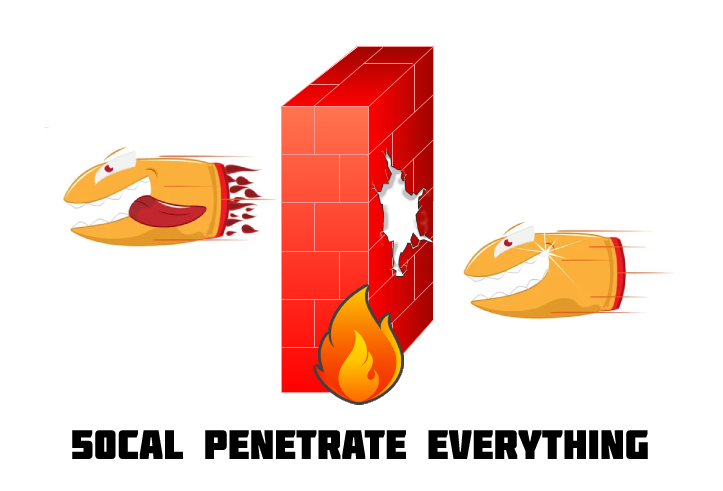

# lib50cal

obfuscated vpn solution designed to bypass dpi and advance tls inspection techniques. this repository contains go package and library to implement 50cal secure vpn   

this is my personal repo [@sina-ghaderi](github.com/sina-ghaderi) checkout our community driven version under [heapz](https://github.com/heapz)

  

  
- TODO: Create A TODO
- client and server implementation in go
- design protocol and some sort of RFC
